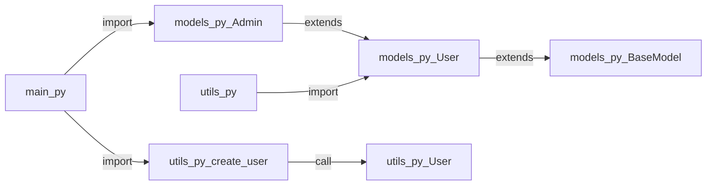
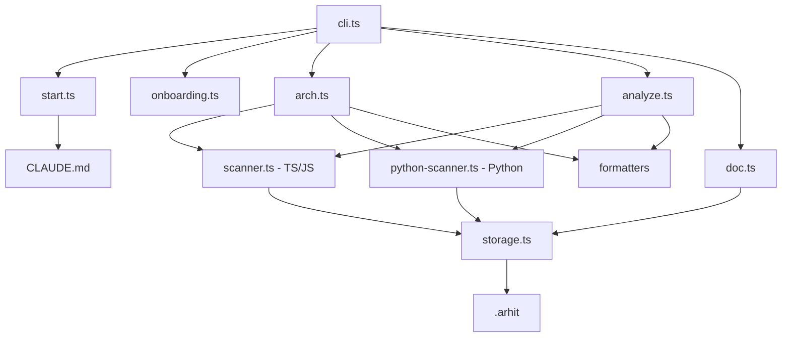

<p align="center">
  <h1 align="center">arhit</h1>
  <p align="center">
    <strong>CLI для архитектуры и документации кода</strong><br>
    <em>Для ИИ-агентов и людей</em>
  </p>
  <p align="center">
    
    
    
    
  </p>
</p>

---

**arhit** сканирует кодовую базу, строит граф архитектуры, анализирует все зависимости и цепочки вызовов, позволяет документировать каждый элемент. Все данные — JSON и Markdown в `.arhit/`, готовы для git.

> **Два режима работы:** JSON для ИИ-агентов (по умолчанию) и `-H` для красивого вывода людям.

## Возможности

- **Архитектура** — AST-анализ кода, построение графа модулей, файлов и элементов
- **Карта зависимостей** — что от чего зависит, что что вызывает, кто кого наследует
- **Документация** — привязка описаний к функциям/классам/файлам + свободные страницы
- **Мультиязычность** — TypeScript/JavaScript (ts-morph) и Python (regex-парсер)
- **Форматы вывода** — JSON, ASCII-дерево, Mermaid-диаграммы, Graphviz DOT
- **Git-friendly** — вся информация в `.arhit/`, версионируется вместе с кодом
- **Claude-интеграция** — при `arhit start` создаётся секция в `CLAUDE.md` с инструкциями для агента

---

## Установка

```bash
# npm (глобально)
npm install -g arhit

# Homebrew
brew tap igorgerasimov/arhit
brew install arhit

# Из исходников
git clone https://github.com/igorgerasimov/arhit.git
cd arhit && npm install && npm run bundle && npm link
```

---

## Быстрый старт

```bash
arhit start                          # Инициализация (автоопределение языка)
arhit arch build                     # Построить архитектуру
arhit -H arch show                   # Посмотреть дерево
arhit analyze                        # Анализ зависимостей
arhit -H deps myFunction             # Кто зависит от myFunction?
arhit -H calls myFunction            # Что вызывает myFunction?
arhit -H map --format mermaid        # Карта взаимодействий
arhit doc add myFunction --content "Описание функции"
```

---

## Команды

### Настройка

| Команда | Описание |
|---------|----------|
| `arhit start` | Инициализация `.arhit/`, автоопределение языка/фреймворка, создание `CLAUDE.md` |
| `arhit onboarding` | Интерактивный мастер настройки (человек) / вывод конфига (агент) |

### Архитектура

| Команда | Описание |
|---------|----------|
| `arhit arch build` | Сканирование кода через AST, построение графа архитектуры |
| `arhit arch show [target]` | Показать архитектуру (фильтр по файлу/элементу) |
| `arhit arch show -f tree\|json\|mermaid` | Выбор формата вывода |

### Анализ зависимостей

| Команда | Описание |
|---------|----------|
| `arhit analyze` | Полный анализ: импорты, вызовы, наследование |
| `arhit deps <element>` | Обратные зависимости: кто зависит от элемента |
| `arhit calls <element>` | Прямые зависимости: что элемент вызывает |
| `arhit map -f json\|mermaid\|dot` | Полная карта взаимодействий |

### Документация

| Команда | Описание |
|---------|----------|
| `arhit doc add <element> -c "..."` | Задокументировать функцию/класс/файл |
| `arhit doc show <element>` | Просмотр документации элемента |
| `arhit doc list` | Список всех задокументированных элементов |
| `arhit doc create <name>` | Создать свободную страницу документации |
| `arhit doc search <query>` | Поиск по документации |

---

## Примеры использования

### TypeScript-проект

```
$ arhit -H arch show

├── cli.ts
│   ├── program [variable]
│   └── arch [variable]
├── storage.ts (exports: readJson, writeJson, configPath, ...)
│   ├── readJson [function] (exports: readJson)
│   ├── writeJson [function] (exports: writeJson)
│   └── ...
└── analyzer/scanner.ts (exports: createProject, buildArchNodes, buildDependencies)
    ├── createProject [function]
    ├── buildArchNodes [function]
    └── buildDependencies [function]
```

### Python-проект

```
$ arhit -H arch show

├── main.py (exports: main)
│   └── main [function]
├── models.py (exports: BaseModel, User, Admin)
│   ├── BaseModel [class]
│   ├── User [class]
│   └── Admin [class]
└── utils.py (exports: MAX_RETRIES, format_greeting, create_user)
    ├── MAX_RETRIES [variable]
    ├── format_greeting [function]
    └── _internal_helper [function]
```

### Карта зависимостей (Mermaid)



### Обратные зависимости

```
$ arhit -H deps User

Dependencies on "User":
  src/models.py:Admin --[extends]--> User
  src/utils.py --[import]--> User
  src/utils.py:create_user --[call]--> User
```

---

## Двойной режим

| Режим | Флаг | Вывод | Для кого |
|-------|------|-------|----------|
| Агент | *(по умолчанию)* | JSON | ИИ-агенты, скрипты, автоматизация |
| Человек | `-H` | Деревья, таблицы, текст | Разработчики |

```bash
# Агент получает JSON
arhit arch show
# [{"id":"src/cli.ts","name":"cli.ts","type":"file",...}]

# Человек получает дерево
arhit -H arch show
# ├── cli.ts
# │   └── program [variable]
```

---

## Хранилище `.arhit/`

Все данные в директории `.arhit/` — добавьте в git для версионирования:

```
.arhit/
├── config.json          # Настройки проекта (язык, пути, игнор)
├── architecture.json    # Граф архитектуры
├── dependencies.json    # Карта зависимостей
└── docs/                # Документация
    ├── _index.json      # Индекс задокументированных элементов
    ├── createProject.md
    └── User.md
```

---

## Форматы вывода

| Формат | Флаг | Назначение |
|--------|------|------------|
| **JSON** | `--format json` | API, агенты, автоматизация |
| **Tree** | `--format tree` | Читаемый обзор для терминала |
| **Mermaid** | `--format mermaid` | Диаграммы в GitHub, Notion, документации |
| **DOT** | `--format dot` | Graphviz (`dot -Tpng graph.dot -o graph.png`) |

---

## Поддерживаемые языки

| Язык | Движок | Что извлекается |
|------|--------|----------------|
| **TypeScript / JavaScript** | ts-morph (AST) | Функции, классы, интерфейсы, типы, перечисления, переменные, импорты, вызовы, наследование |
| **Python** | Regex-парсер | Функции, классы, переменные, импорты (`from`/`import`), вызовы, наследование, приватные элементы (`_prefix`) |

---

## Архитектура arhit

```
src/
├── cli.ts                      # Точка входа CLI (Commander.js)
├── types.ts                    # Определения типов
├── storage.ts                  # Файловый слой хранения
├── analyzer/
│   ├── scanner.ts              # AST-анализ TypeScript/JavaScript (ts-morph)
│   └── python-scanner.ts       # Regex-анализ Python
├── commands/
│   ├── start.ts                # Инициализация + генерация CLAUDE.md
│   ├── onboarding.ts           # Мастер настройки
│   ├── arch.ts                 # Команды архитектуры
│   ├── analyze.ts              # Команды анализа зависимостей
│   └── doc.ts                  # Команды документации
└── formatters/
    ├── json.ts                 # JSON
    ├── tree.ts                 # ASCII-дерево
    ├── mermaid.ts              # Mermaid-диаграммы
    └── dot.ts                  # Graphviz DOT
```

### Потоки данных



---

## Интеграция с Claude

При выполнении `arhit start` в файл `CLAUDE.md` (или `.claude/CLAUDE.md`, если существует) добавляется секция с инструкциями для ИИ-агента:

- Какие команды использовать для исследования кода
- Когда обновлять архитектуру и зависимости
- Как документировать новые элементы

Секция обёрнута в маркеры `<!-- arhit:start -->` / `<!-- arhit:end -->` и безопасно обновляется без потери пользовательских данных.

---

## Лицензия

MIT
